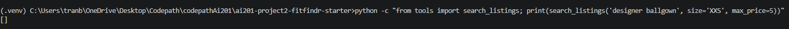

# FitFindr

This starter kit contains everything you need to begin Project 2.

## What's Included

```
ai201-project2-fitfindr-starter/
├── data/
│   ├── listings.json          # 40 mock secondhand listings
│   └── wardrobe_schema.json   # Wardrobe format + example wardrobe
├── utils/
│   └── data_loader.py         # Helper functions for loading the data
├── planning.md                # Your planning template — fill this out first
└── requirements.txt           # Python dependencies
```

## Setup

```bash
pip install -r requirements.txt
```

Set your Groq API key in a `.env` file (get a free key at [console.groq.com](https://console.groq.com)):
```
GROQ_API_KEY=your_key_here
```

## The Mock Listings Dataset

`data/listings.json` contains 40 mock secondhand listings across categories (tops, bottoms, outerwear, shoes, accessories) and styles (vintage, y2k, grunge, cottagecore, streetwear, and more).

Each listing has: `id`, `title`, `description`, `category`, `style_tags`, `size`, `condition`, `price`, `colors`, `brand`, and `platform`.

Load it with:
```python
from utils.data_loader import load_listings
listings = load_listings()
```

## The Wardrobe Schema

`data/wardrobe_schema.json` defines the format your agent uses to represent a user's existing wardrobe. It includes:

- `schema`: field definitions for a wardrobe item
- `example_wardrobe`: a sample wardrobe with 10 items you can use for testing
- `empty_wardrobe`: a starting template for a new user

Load an example wardrobe with:
```python
from utils.data_loader import get_example_wardrobe
wardrobe = get_example_wardrobe()
```

## Running the App

```bash
python app.py
```

Open the localhost URL printed in your terminal (usually `http://localhost:7860`).

To run the agent directly from the command line:

```bash
python agent.py
```

---

## Tool Inventory

### `search_listings(description, size, max_price)`

**Purpose:** Searches the mock listings dataset for secondhand items matching the query. Filters by price and size, then ranks based on keyword overlap. If nothing is matched on the first pass, then remove size from the filter and retries the search. If nothin again returns a message about strict search criteria.

| Parameter | Type | Description |
|-----------|------|-------------|
| `description` | `str` | Garment keywords (type, style, color, era, brand), e.g. `"vintage graphic tee"` |
| `size` | `str \| None` | Size code to filter by (`"M"`, `"8"`, `"S/M"`), or `None` to skip size filtering. Matched case-insensitively and token-by-token so `"M"` matches `"S/M"`. |
| `max_price` | `float \| None` | Inclusive price ceiling, or `None` to skip price filtering. |

**Returns:** `list[dict]` — matching listings sorted by relevance score . Each dict contains: `id`, `title`, `description`, `category`, `style_tags` (list), `size`, `condition`, `price` (float), `colors` (list), `brand`, `platform`. Returns `[]` when nothing matches. 

---

### `suggest_outfit(new_item, wardrobe)`

**Purpose:** Calls the Groq LLM to suggest 1-2 complete outfits pairing the thrifted item with the user's existing wardrobe as well as reasons why. Falls back to general styling advice when the wardrobe is empty.

| Parameter | Type | Description |
|-----------|------|-------------|
| `new_item` | `dict` | A listing dict from `search_listings` — uses `title`, `category`, `style_tags`, and `colors` to build the prompt. |
| `wardrobe` | `dict` | Wardrobe dict with an `items` key (list of wardrobe-item dicts). May be empty — handled gracefully. |

**Returns:** `str` — 1-2 outfit suggestions. If there are items in the wardrobe gives the names of the specific pieces and reasons why its a good fit. With an empty wardrobe, returns general styling advice.

---

### `create_fit_card(outfit, new_item)`

**Purpose:** Turns the outfit suggestion into a shareable caption. Runs at high temperature so the output reads differently each time.

| Parameter | Type | Description |
|-----------|------|-------------|
| `outfit` | `str` | The outfit-suggestion string returned by `suggest_outfit`. |
| `new_item` | `dict` | The listing dict for the thrifted item — used to mention the item name, price, and platform once each in the caption. |

**Returns:** `str` — a 2–4 sentence casual caption that names the item, its price, and its platform once each. If the outfit parameter is empty or whitespace, returns an error string without calling the LLM. If the LLM call fails, returns a short fallback caption built from the item fields.

---

## Planning Loop

The loop advances through five stages, each in sequence.

```
Parse → Search → (retry?) → Select → Suggest → Caption → return session
                    ↓
              [error + early exit]
```

**Step-by-step logic:**

1. **Parse** — calls `parse_query(query)` (Groq LLM, temperature 0, JSON output) to extract `description`, `size`, and `max_price`. On any parse failure, falls back to `{description: raw_query, size: None, max_price: None}` and continues.

2. **Search** — calls `search_listings(description, size, max_price)`. The agent then **checks the result count**:
   - Results found → proceed to Select.
   - Zero results **and** a size filter was applied → **retry** `search_listings` with `size=None`. If the retry finds items, continue with them.
   - Still zero results → set `session["error"]` to a specific message (names the description, size, and price that were searched, and what to loosen), then return early. `suggest_outfit` and `create_fit_card` are never called.

3. **Select** — takes `search_results[0]` or the most relevant item as `session["selected_item"]`.

4. **Suggest** — calls `suggest_outfit(selected_item, wardrobe)`. The tool branches on whether the wardrobe has items or is empty the planning loop passes.

5. **Caption** — calls `create_fit_card(outfit_suggestion, selected_item)` only if `outfit_suggestion` is not empty. Stores the result in `session["fit_card"]`.

---

## State Management

A single **session dict** is how the agent keeps track of each stage reads and writes to.

| Field | Written by | Read by |
|-------|-----------|---------|
| `query` | `_new_session` (raw input) | `parse_query` |
| `parsed` (`description` / `size` / `max_price`) | parse step | `search_listings` |
| `search_results` (list of listing dicts) | search step | select step |
| `selected_item` (top listing dict) | select step | `suggest_outfit`, `create_fit_card` |
| `wardrobe` | `_new_session` (from UI choice) | `suggest_outfit` |
| `outfit_suggestion` (str) | suggest step | `create_fit_card` |
| `fit_card` (str) | caption step | returned to UI |
| `error` (str \| None) | any step that exits early | UI (shown instead of results) |

1. `search_results` is stored after `search_listings` is called. 
2. `selected_item` is updated with the top result in `search_results`. 
3. `selected_item` and `wardrobe` are passed to `suggest_outfit` where `outfit_suggestion` is then updated
4.  `outfit_suggestion` is passed to `create_fit_card` and `fit_card` is updated

---

## Error Handling

| Tool | Failure mode | Agent response |
|------|-------------|----------------|
| `search_listings` | No results match the query | If a size filter was applied, retry once with `size=None`. If still empty, stop before `suggest_outfit` and return a specific message naming the description, size, and price that were searched, e.g. *"No items matched 'designer ballgown' in size XXS under $5. We already tried broadening by removing the size filter and still found nothing — try raising your price or using different keywords."* |
| `suggest_outfit` | Wardrobe is empty | Not treated as an error — the tool branches to a general-styling-advice prompt for the item instead of naming wardrobe pieces. If the LLM call itself fails, returns a graceful fallback string (item title + price + platform) so `create_fit_card` can still run. |
| `create_fit_card` | `outfit` is empty or whitespace-only | Returns `"No outfit was provided, so there's nothing to caption."` without calling the LLM. If the LLM call fails, returns a short fallback caption built from the item fields. Never raises. |


Query: `"designer ballgown size XXS under $5"`

1. Parse extracts `{description: "designer ballgown", size: "XXS", max_price: 5}`.
2. `search_listings("designer ballgown", "XXS", 5)` returns `[]`.
3. Agent retries with `size=None`: `search_listings("designer ballgown", None, 5)` — still `[]`.
4. Agent sets `session["error"]` and returns the session early

### Output



---

## Spec Reflection

**One way the spec helped:** Drafting the spec before implementing streamlined the implementation process for CLAUDE. It was as simple as implement this based on what we discussed. I didn't have to go back add on to the prompt like handling failure cases, parsing problems etc.

**One divergence from the spec and why:** The spec's State Management table listed `selected_item` as written by the "select step" and read by both `suggest_outfit` and `create_fit_card`. In the implementation, `create_fit_card` reads `selected_item` directly from the session rather than from a local variable, which matches the spec's intent but wasn't made explicit in the original table.

**AI Usage Transparency:**
I used AI to help figure out how everything was supposed to flow first before drafting planning.md. I used CLAUDE to help understand the what each tool was supposed to do and its failure cases, understand how sessions are handled, and finally draft up the architecture.

CLAUDE was used to implement the tools and the agent loop based on the specs I chose in planning.md. Claude was also used to generate a test suite to see if all of the tools are working as intended as well as test whether each failure case fails gracefully.
