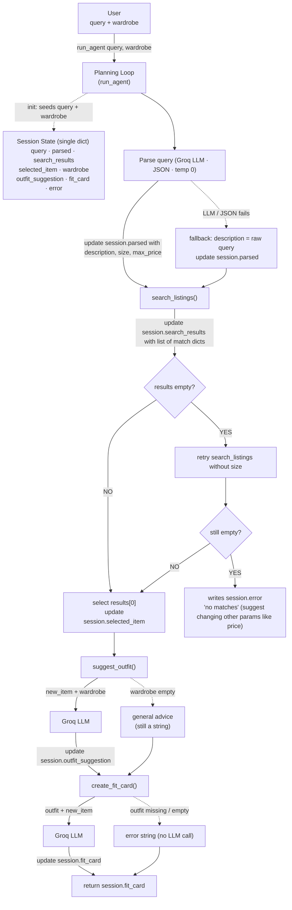

# FitFindr — planning.md

> Complete this document before writing any implementation code.
> Your spec and agent diagram are what you'll use to direct AI tools (Claude, Copilot, etc.) to generate your implementation — the more specific they are, the more useful the generated code will be.
> Your planning.md will be reviewed as part of your submission.
> Update it before starting any stretch features.

---

## Tools

### Tool 1: search_listings

**What it does:**
Searches the listings for secondhand items matching the user's request. It filters by price and size, then ranks the survivors by how well their text matches the description keywords.

**Input parameters:**
- `description` (str): keywords describing the garment (type, style, color, era, brand), e.g. `"vintage graphic tee"`.
- `size` (str | None): a size code to filter by (e.g. `"M"`, `"8"`), or `None` to skip size filtering. Matched case-insensitively or as a substring.`"M"` matches a listing sized `"S/M"` and `"M"` also matches to `"m"`.
- `max_price` (float | None): inclusive price ceiling, or `None` to skip price filtering.

**What it returns:**
A `list[dict]` of matching listings, **sorted by relevance score (best match first)**. Each dict is a full listing with: `id`, `title`, `description`, `category`, `style_tags` (list), `size`, `condition`, `price` (float), `colors` (list), `brand`, `platform`. Listings with a keyword-overlap score of 0 are dropped. Returns an empty list `[]` when nothing matches it never raises.

**Scoring approach:**
Tokenize `description`; for each listing surviving the filters, count how many keywords appear across its `title`, `description`, `style_tags`, `category`, and `colors`. Drop score-0 listings, then sort by score descending.

**What happens if it fails or returns nothing:**
Returns `[]`. The agent (not the tool) reacts: if a `size` filter was applied, it retries the search **without** the size filter as a fallback; if that still returns nothing, the agent stops before `suggest_outfit` and returns a specific message telling the user what was searched and what to loosen.

---

### Tool 2: suggest_outfit

**What it does:**
Given the thrifted item the agent selected and the user's wardrobe, asks the Groq LLM to suggest 1–2 complete outfit combinations. When the wardrobe has items, it names specific pieces from it; when the wardrobe is empty, it gives general styling advice for the item instead.

**Input parameters:**
- `new_item` (dict): a listing dict from `search_listings` (the item under consideration). The tool uses its `title`, `category`, `style_tags`, and `colors` to build the prompt.
- `wardrobe` (dict): a wardrobe dict with an `items` key a list of wardrobe-item dicts (`name`, `category`, `colors`, `style_tags`, `notes`). May be empty (`items: []`).

**What it returns:**
A `str` describing one or two outfits. With a populated wardrobe it references the user's actual pieces by name; with an empty wardrobe it returns general styling guidance (what pairs well, what vibe it suits) rather than an error or empty string.

**What happens if it fails or returns nothing:**
An empty wardrobe is not treated as an error the tool branches to the general-advice prompt. If the LLM call itself fails (network/API error), the tool returns a graceful fallback string (e.g. "Couldn't generate an outfit right now here's the item on its own…") so the agent can still proceed to `create_fit_card`; it never raises or returns "".

---

### Tool 3: create_fit_card

**What it does:**
Turns the chosen outfit into a short, shareable caption the kind of thing you'd put under an OOTD post. Calls the Groq LLM at a high temperature so the output reads differently for different inputs (and across runs).

**Input parameters:**
- `outfit` (str): the outfit-suggestion string returned by `suggest_outfit`.
- `new_item` (dict): the listing dict for the thrifted item, used so the caption can mention the item name, price, and platform naturally (once each).

**What it returns:**
A 2–4 sentence `str` caption: casual and authentic (not a product blurb), naming the item, its price, and its platform once each, and capturing the outfit vibe in specific terms. Because temperature is high, two different outfits/items produce noticeably different captions.

**What happens if it fails or returns nothing:**
If `outfit` is empty or whitespace-only, the tool returns a descriptive error string (e.g. "No outfit was provided, so there's nothing to caption.") instead of calling the LLM it never raises. If the LLM call fails, it returns a short fallback caption built from the item fields so the user still gets something usable.

---

### Additional Tools (if any)

None

---

## Planning Loop

**How does your agent decide which tool to call next?**

The loop advances through stages, but each transition is **guarded by the state left behind by the previous tool** it is not a fixed call-all-three sequence. At each step the agent inspects the session dict and decides whether to continue, branch to a fallback, or stop.

1. **Parse** — call `parse_query(query)`; store the result in `session["parsed"]`. On parse failure, fall back to `{description: raw query, size: None, max_price: None}`.
2. **Search** — call `search_listings(**parsed)`; store in `session["search_results"]`. Now the agent **checks the result count**:
   - **Results found** → proceed to step 3.
   - **Zero results AND a size filter was applied** → the agent **does not give up**: it retries `search_listings` with `size=None` (fallback branch) and, if that returns items, continues with them while noting "no exact size match, showing other sizes."
   - **Still zero results** → set `session["error"]` to a specific message naming the description / size / price that were searched and what to loosen, then **return early**. `suggest_outfit` and `create_fit_card` are never called.
3. **Select** — take `search_results[0]` (highest score) as `session["selected_item"]`.
4. **Suggest** — call `suggest_outfit(selected_item, wardrobe)`; store in `session["outfit_suggestion"]`. The tool internally branches on whether the wardrobe is empty (specific outfits vs. general advice) — the agent passes whichever wardrobe it was given.
5. **Caption** — only if `outfit_suggestion` is non-empty, call `create_fit_card(outfit_suggestion, selected_item)`; store in `session["fit_card"]`.
6. **Done** — return the session. The interaction is complete when either `fit_card` is set (success) or `error` is set (early exit).

**What changes its behavior:** the result count from `search_listings` (continue / retry-without-size / stop), the parse outcome (real params vs. raw-query fallback), and whether the wardrobe has items (handled inside `suggest_outfit`).

---

## State Management

**How does information from one tool get passed to the next?**

A single **session dict** (created by `_new_session()` in [agent.py](agent.py)) is the one source of truth for an interaction. Each stage writes its output into the session, and the next stage reads its input from the session.

| Field | Written by | Read by |
|-------|-----------|---------|
| `query` | `_new_session` (raw input) | `parse_query` |
| `parsed` (`description`/`size`/`max_price`) | parse step | `search_listings` |
| `search_results` (list of listings) | search step | select step |
| `selected_item` (top listing dict) | select step | `suggest_outfit`, `create_fit_card` |
| `wardrobe` | `_new_session` (from UI choice) | `suggest_outfit` |
| `outfit_suggestion` (str) | suggest step | `create_fit_card` |
| `fit_card` (str) | caption step | returned to UI |
| `error` (str \| None) | any step that exits early | UI (shown instead of results) |

**The key hand-offs** `search_listings` writes `selected_item`, which flows directly into `suggest_outfit` (the user never re-types the item); `suggest_outfit` writes `outfit_suggestion`, which flows directly into `create_fit_card` (the outfit isn't re-entered). The session is returned whole to the UI, which maps `selected_item` → listing panel, `outfit_suggestion` → outfit panel, `fit_card` → caption panel, or `error` → the first panel on early exit.

---

## Error Handling

For each tool, describe the specific failure mode you're handling and what the agent does in response.

| Tool | Failure mode | Agent response |
|------|-------------|----------------|
| search_listings | No results match the query | If a size filter was applied, retry once with `size=None`. If still empty, stop before `suggest_outfit` and return a specific message: what description/size/price was searched and what to loosen (e.g. "No items under $5 matched 'designer ballgown' in size XXS try raising your price or removing the size."). |
| suggest_outfit | Wardrobe is empty | Not an error: branch to a general-styling-advice prompt for the item instead of naming wardrobe pieces. (Secondary: if the LLM call fails, return a graceful fallback string so the agent can still caption.) |
| create_fit_card | Outfit input is missing or incomplete | Guard before calling the LLM if `outfit` is empty/whitespace, return a descriptive error string ("No outfit was provided, so there's nothing to caption.") rather than raising or fabricating a caption. |

---

## Architecture

Each phase node shows the one session field it writes (`→ writes session.X`); the loop reads earlier fields back out to feed each tool. The Session State box is a legend of all fields, seeded with `query` + `wardrobe` at init.

---

## AI Tool Plan

**Tool used:** Claude (via Claude Code in the IDE), working directly against this planning.md.

**Query parsing (preprocessing):** Give Claude the parsing spec (3-key output schema, size normalization, range→ceiling rules) and have it draft the system prompt + few-shot examples. Verify the parsed output matches the expected `description`/`size`/`max_price` on the example queries plus a couple of stress cases (word-size normalization, price ranges) before relying on it.

**Milestone 3 — Individual tool implementations:**
- **`search_listings`** — Give Claude the Tool 1 spec (inputs, filter rules, keyword-scoring approach, "return `[]` never raise") plus the `load_listings()` signature from [utils/data_loader.py](utils/data_loader.py). Verify by testing: a happy query (returns scored matches), a too-cheap query (returns `[]`), and a size-filter query (confirm substring matching like "M" → "S/M").
- **`suggest_outfit`** — Give Claude the Tool 2 spec including the empty-vs-populated wardrobe branch. Verify against the example wardrobe (names real pieces) and the empty wardrobe (general advice, non-empty string, no crash).
- **`create_fit_card`** — Give Claude the Tool 3 spec (style guidelines, high temperature, mention item/price/platform once). Verify that no outfit returns an error string and that two different outfits produce visibly different captions.

**Milestone 4 — Planning loop and state management:**
Give Claude the **Planning Loop**, **State Management**, and **Architecture** sections plus the `_new_session()` field list, and ask it to implement `run_agent()` matching the guarded transitions exactly. Verify by running `python agent.py` (built-in happy-path + no-results cases) and confirming `selected_item` flows into `suggest_outfit` and `outfit_suggestion` into `create_fit_card` without re-entry. Every Claude-generated block is read against the relevant spec section before being accepted; anything that drifts (e.g. calling all three tools unconditionally) is rejected and re-prompted.

---

## A Complete Interaction (Step by Step)

**What FitFindr needs to do:** FitFindr takes a thrifting request and orchestrates three tools. search_listings() runs first on the parsed query to find matching secondhand items, suggest_outfit() is triggered once a listing is selected to pair it against the user's wardrobe, and create_fit_card() runs last to caption the chosen outfit. The agent decides each step from what the previous tool returned rather than calling all three unconditionally. When something fails it stops and reports the problem specifically instead of crashing so, if search_listings returns no matches the agent tells the user nothing fit and asks them to loosen the size or price, if the wardrobe is empty suggest_outfit falls back to general styling advice for the item, and if the outfit string is missing create_fit_card returns a clear error message instead of a caption.

**Example user query:** "I'm looking for a vintage graphic tee under $30. I mostly wear baggy jeans and chunky sneakers. What's out there and how would I style it?"

**Step 1 — Parse.** The agent initializes the session and calls `parse_query(query)`. The LLM returns `{"description": "vintage graphic tee", "size": null, "max_price": 30}`, stored in `session["parsed"]`. (The "baggy jeans and chunky sneakers" detail is context for styling, not a search filter, so it isn't extracted here it informs Step 4 via the wardrobe.)

**Step 2 — Search.** The agent calls `search_listings("vintage graphic tee", size=None, max_price=30)`. Listings are filtered to ≤ $30, scored by keyword overlap, and returned best-first into `session["search_results"]`. The agent checks the count: results were found, so it stays on the happy path (no retry, no early exit).

**Step 3 — Select.** The agent takes `search_results[0]` the highest-scoring tee under $30 and stores it as `session["selected_item"]`. This dict is now the shared item for the rest of the run; the user never re-enters it.

**Step 4 — Suggest outfit.** The agent calls `suggest_outfit(selected_item, wardrobe)`. The example wardrobe has items (baggy jeans, chunky sneakers, etc.), so the tool takes the populated branch and the LLM returns specific combinations naming those pieces. Stored in `session["outfit_suggestion"]`.

**Step 5 — Caption.** Since the outfit string is non-empty, the agent calls `create_fit_card(outfit_suggestion, selected_item)`. At high temperature the LLM returns a casual 2–4 sentence caption mentioning the tee's name, price, and platform once each. Stored in `session["fit_card"]`.

**Final output to user:** The UI shows three panels the **listing** (`selected_item`: title, price, condition, platform), the **outfit idea** (`outfit_suggestion`, styled around their real wardrobe), and the fit card (`fit_card`, ready to copy into a post caption). `session["error"]` is `None`, confirming a clean run through all three required tools.
